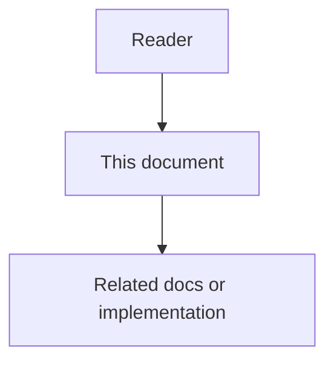

# Tenant Isolation Threat Model (Wedge Scope)

## Purpose

Minimal threat model and enforcement checks for AgentCore v1 wedge isolation (code-graph + MCP scope). Closes GAP-005 for single-tenant lab sales mode.

## Document flow

| Step | Actor | Action | Outcome |
| --- | --- | --- | --- |
| 1 | Reader | Opens this design document | Understands scope and constraints |
| 2 | Reader | Follows the Mermaid flow | Sees primary component interactions |
| 3 | Reader | Uses Related Documents / linked symbols | Reaches deeper design or implementation |

## Scope

Covers **code-graph store** and **MCP gateway** tool dispatch for the coding
wedge. Broader broker/object-store isolation remains platform follow-up.

## Threats

| ID | Threat | Mitigation |
| --- | --- | --- |
| T1 | Cross-tenant symbol/edge read via graph API | Every store query filters `tenant_id` + `workspace_id` + `project_id` |
| T2 | Cross-project leak within same tenant | Same triple filter; project_id required |
| T3 | MCP tool call with forged/mismatched scope | Gateway binds tools to process env scope; handlers pass scope into store |
| T4 | Marketing multi-tenant before enforcement proven | Product scope: **single-tenant lab OK**; multi-tenant sales blocked until suite green |

## Enforcement tests

- `tests/backend/services/code-graph-service/test_tenant_isolation.py` (in-memory)
- `tests/backend/services/mcp-gateway-service/test_mcp_tenant_isolation.py` (MCP memory graph)
- `tests/backend/services/code-graph-service/test_tenant_isolation_neo4j_live.py` (Neo4j; `-m live`, skips if Compose down)

## v1 mode

**Single-tenant lab / demo:** allowed when one tenant owns the deploy.

**Multi-tenant SaaS:** blocked for commercial claims until these tests stay green
on the production store path (Neo4j) and remaining platform surfaces are covered.
