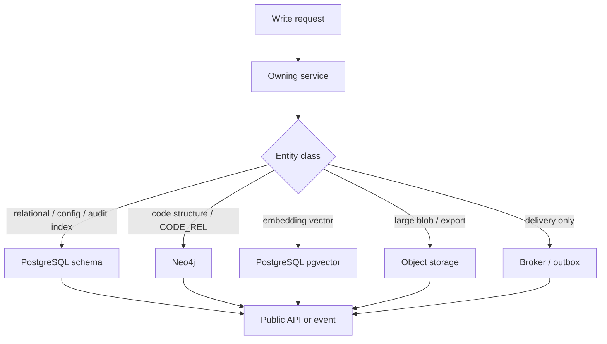

# 13 - Storage Ownership Matrix

## Purpose

Pins the authoritative store and owning service for each durable AgentCore entity and event class so relational, graph, vector, object, and broker persistence do not compete as duplicate sources of truth.

This document closes **GAP-001**. Product-per-role store selection remains in `04-data-rag-analytics-and-storage-stack.md`. Persistence access rules remain in `../08-software-engineering-architecture/09-data-and-persistence-engineering.md`.

## Decision flow

| Step | Actor | Action | Outcome |
| --- | --- | --- | --- |
| 1 | Service | Classifies the write by entity class | One owning service selected |
| 2 | Service | Writes only to its authoritative store | No cross-service private table/graph writes |
| 3 | Consumer | Reads via owning API, projection, or subscribed event | No duplicate SoR |

## Store roles (normative)

| Store | Role | Must not hold |
| --- | --- | --- |
| PostgreSQL | Transactional SoR for work records, identity/scope, rules/profiles metadata, docs-sync state, audit indexes, reporting aggregates | Relationship-heavy code traversal as primary engine |
| Neo4j | Structural code-graph SoR (`CodeSymbol`, `CODE_REL`, routes, tests, docs links) | Durable tasks, approvals, tenant IAM, or embedding SoR |
| PostgreSQL + pgvector | Durable embedding SoR for memory and code-symbol vectors | Sole ACL/tenant truth (filter from relational scope first) |
| Object storage | Large artifacts, evidence bundles, exports, diagnostics, graph snapshots | Canonical entity state or small config |
| Redis (optional) | TTL cache, locks, rate limits, ephemeral job coordination | Durable business or graph truth |
| Broker / outbox | Delivery, retry, dead-letter | Source of truth after consumer apply |

**Code-graph rollback:** PostgreSQL `code_graph` projection remains a supported alternate (`AGENTCORE_CODE_GRAPH_STORE=postgres`) for parity/rollback only. Neo4j is the default SoR. Dual-write is not required for v1.

**Optional turbovec:** rebuildable ANN replica only; pgvector stays embedding SoR (`08-turbovec-ann-acceleration-integration.md`).

## Entity ownership matrix

| Entity / record class | Authoritative store | Owning service | Consumers (read path) |
| --- | --- | --- | --- |
| Tenant, workspace, project, project group | PostgreSQL | identity-access / project-profile | All scoped services via scope claims / profile API |
| Usage profile, connect pins, port profile | PostgreSQL + config files | project-profile / CLI packages | MCP gateway, CLI |
| WorkLog, Activity, Issue, Task, Decision | PostgreSQL | core-data-service | audit, orchestration, reporting via API/events |
| Approval ticket / escalation state | PostgreSQL | rule-engine-service (+ core-data refs) | admin/IDE adapters via API |
| Policy / rule pack / DomainPack / FeatureProfile metadata | PostgreSQL + versioned config under `backend/configs/` | rule-engine / project-profile | orchestration, MCP capability gates |
| MemoryItem, WeightProfile, FAQ / QuestionMemory rows | PostgreSQL | memory-service | agents via retrieval API |
| Memory / doc / symbol embeddings | PostgreSQL pgvector | memory-service or code-graph-service (by kind) | hybrid retrieval only after ACL filter |
| CodeSymbol, File, Route, Rationale nodes | Neo4j | code-graph-service | MCP/CLI explore, hybrid, risk |
| CODE_REL (`CALLS`, `IMPORTS`, `ROUTES_TO`, `TESTED_BY`, …) | Neo4j | code-graph-service | impact / architecture tools |
| Docs drift finding, doc flag index, sync cursor | PostgreSQL | docs-sync-service | CI gates, CLI docs commands |
| DOCUMENTED_BY edges to code symbols | Neo4j | code-graph-service (writer); docs-sync proposes via contract | explore / hybrid packs |
| Audit event index / timeline pointer | PostgreSQL | audit-service | incident reconstruction API |
| Evidence bundle bytes | Object storage | audit-service or producing service | audit API with signed refs |
| Domain event in flight | Broker + owning-service outbox | producing service | consumers via inbox |
| Adapter connection secrets | Secret store / env (not git); metadata in PostgreSQL | adapter-service | runtime only |
| Impact KPI / gap / risk catalogs | Config JSON under `backend/configs/governance/` | platform governance packages | phase gates, reporting |

## Event classes

| Event class | Persist where | Authority |
| --- | --- | --- |
| Domain change events (`TaskCreated`, `RuleActivated`, …) | Outbox row (PostgreSQL) then broker | Owning service of the aggregate |
| Delivery failures | Broker DLQ + audit pointer | Broker ops + audit-service |
| Graph ingest completion | Neo4j revision metadata + optional PostgreSQL job row | code-graph-service |

## Invariants

1. Exactly one authoritative store per entity class above.
2. Other stores may hold **projections or caches** with explicit rebuild instructions; they must not accept independent writes.
3. Services never read or write another service’s private PostgreSQL schema or Neo4j labels except through a published contract.
4. Tenant/workspace/project scope columns (or equivalent properties) are mandatory on durable rows and graph nodes used in retrieval.
5. Changing this matrix requires an ADR and updates to data contracts / migrations in the owning service.

## Verification

- Unit/contract tests for owning repositories reject cross-store writes for the entity class under test.
- Code-graph store selection tests cover Neo4j default and Postgres rollback mode.
- Gap register entry **GAP-001** status `CLOSED` with this document as resolution artifact.

## Related Documents

- `04-data-rag-analytics-and-storage-stack.md` — product-per-role store baseline
- `../08-software-engineering-architecture/09-data-and-persistence-engineering.md` — persistence boundaries
- `../07-code-knowledge-graph/11-neo4j-migration-plan.md` — graph store cutover
- `../10-gap-analysis/01-gap-register.md` — GAP-001
