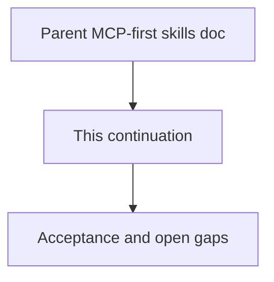

# 06 - MCP-First Agent Skills And Rules (Continued)

## Purpose

Continuation of `docs/15-agent-workspace-guidance/06-mcp-first-agent-skills-and-rules.md` — remaining sections after the soft size budget.

## Document flow



| Step | Actor | Action | Outcome |
| --- | --- | --- | --- |
| 1 | Reader | Opens this continuation | Sees remaining workflow and acceptance content |
| 2 | Reader | Follows Related Documents | Returns to the parent skill/rule specification |

## Product Workflow For Coding Agents

```text
MCP connect
  → agentcore-session-bootstrap skill (ping, profile, guidance_resolve)
  → apply always_rule mcp-first-agentcore
  → pick capability skill (memory | code-graph | remove-dead-code | documentation-authoring | docs-sync | durable-write | create-task)
  → for documentation questions / product Markdown: agentcore_docs_authoring_standards first
  → call matching MCP tool(s)
  → then local code edits as needed (including proven dead-code deletes)
```

## Interaction With Usage Profiles

- `programming-cursor-mcp` (and successors) **should** advertise the tools referenced above as they are implemented.
- When guidance MCP tools are not yet implemented, seed skills still document the intended names; session bootstrap degrades to ping + effective profile until guidance tools ship.
- Adding a new AgentCore MCP capability requires: tool catalog entry, skill (or always-on update), agents_entry row, and contract tests.
- `agentcore_code_graph_unused_candidates` is normative in [`../07-code-knowledge-graph/36-dead-code-candidates-and-cleanup-loop.md`](../07-code-knowledge-graph/36-dead-code-candidates-and-cleanup-loop.md) and is advertised on `programming-cursor-mcp` when implemented (task-scoped; requires anchors).

## Acceptance Criteria

- Seed pack defines `mcp-first-agentcore` (including same-change dead-code cleanup, module-contract/README map clauses, and **fix-on-read** for nonconforming product docs + hard-module headers) plus the nine skills in the matrix.
- Exported Cursor layout yields always-apply rule + skill folders an agent can load.
- Feature/product docs state that coding agents must route in-scope work through MCP per this document.
- New MCP tools cannot ship in a programming profile without an owning skill or an explicit always-on clause update.
- Dead-code cleanup skill instructs agents to prove before delete and never asks AgentCore to mutate the repository.
- Connect / client wire materializes the MCP-first seed into the project workspace (conflict-safe) so always-apply rules exist before the first `guidance_resolve`.
- Store upgrade (`ensure_mcp_first_seed`) is not add-only: it refreshes outdated pack bodies, stamps `seed_pack_version`, and suppresses pack skills retired from the catalog so MCP resolve does not serve obsolete text.
- Disk rematerialize on connect refreshes managed pack files when content advances and deletes retired managed `agentcore-*` skill paths (conflict-safe; unmanaged locals stay).

## Open Gaps

| Gap | Notes |
| --- | --- |
| Hard block of writes before resolve | Soft only: always-on rule + `guidance_hint` on durable writes when resolve not yet called in-process |
| Non-Cursor agents | Same skill/rule bodies; layout profile maps paths (`claude_compatible`, `generic_agents_md`) |
| Unused-candidate Neo4j-native query | v1 uses store `list_symbols`/`list_edges`; optional Cypher optimization later |


## Related Documents

- Parent document: `docs/15-agent-workspace-guidance/06-mcp-first-agent-skills-and-rules.md`
