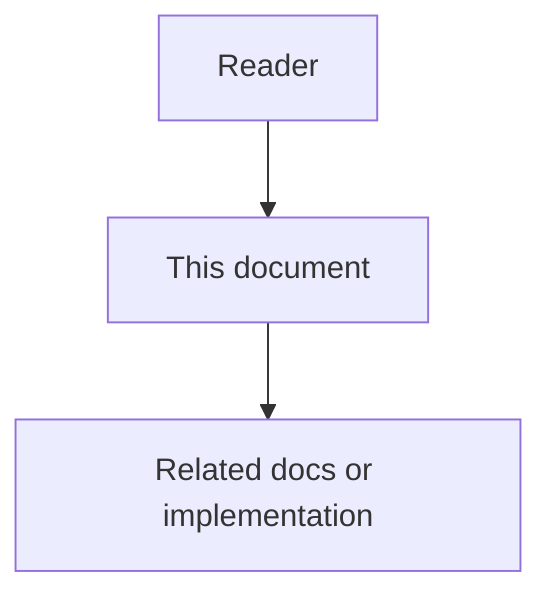

# 06 - MCP-First Agent Skills And Rules

## Purpose

This document specifies the **platform-seeded** always-on rule and on-demand skills that coding agents (Cursor, Claude Code–style clients, and other MCP clients) must follow so that work AgentCore can perform is requested **through MCP** against AgentCore—not reinvented with ad-hoc local scripts, unmanaged chat-only notes, or bypass of governed stores.

These artifacts are first-class `always_rule` / `skill` / `agents_entry` content under Agent Workspace Guidance. They ship as a default seed pack for Usage Profiles such as `programming-cursor-mcp` and may be exported to IDE-native paths.

## Document flow



| Step | Actor | Action | Outcome |
| --- | --- | --- | --- |
| 1 | Reader | Opens this design document | Understands scope and constraints |
| 2 | Reader | Follows the Mermaid flow | Sees primary component interactions |
| 3 | Reader | Uses Related Documents / linked symbols | Reaches deeper design or implementation |


## Problem Statement

MCP tools alone are insufficient: agents often ignore them unless rules and skills tell them *when* and *how* to call AgentCore. Without explicit MCP-first guidance, agents:

- search the repo blindly instead of using the code graph;
- keep facts only in chat instead of memory / durable writes;
- skip docs-sync drift and coverage checks;
- never resolve project guidance before coding.

## Goals

- Define one mandatory always-on rule: prefer AgentCore MCP for in-scope capabilities.
- Define a skill catalog aligned to AgentCore capability areas and current/planned MCP tools.
- Require connect-time `agentcore_guidance_resolve` (when available) before substantive coding.
- Keep skill bodies portable across Cursor and other MCP coding agents (same when/how structure).
- Seed these artifacts from the platform so new projects do not start empty.

## Non-Goals

- Not implementing MCP handlers in this document (contracts remain in [`04-data-contracts-and-events.md`](04-data-contracts-and-events.md) and Usage Profile catalogs).
- Not replacing IDE-local rules used while developing the AgentCore monorepo (`docs/agents/`).
- Not requiring every AgentCore HTTP API to have an MCP twin on day one; skills may say “use MCP if listed on effective profile, else report gap”.

## Always-On Rule: `mcp-first-agentcore`

| Field | Value |
| --- | --- |
| Kind | `always_rule` |
| `name` / slug | `mcp-first-agentcore` |
| `mandatory` | `true` for profiles that enable AgentCore MCP |
| Export (Cursor) | `.cursor/rules/mcp-first-agentcore.mdc` with always-apply |

### Normative body

```markdown
## MCP-first AgentCore
When this workspace is connected to AgentCore over MCP (lazy facade: `mcp_search_tools` → `mcp_execute_tool`):

1. Search then execute `agentcore_guidance_resolve` before substantive coding.
2. For capabilities AgentCore exposes on the active Usage Profile, prefer the matching MCP tool over inventing a local-only substitute.
3. Do not store project facts only in chat when `agentcore_write` or `agentcore_memory_retrieve` can persist or recall them.
4. Do not skip code-graph search when locating symbols AgentCore can index. Prefer structural tools (`callers` / directed `impact` / `community`) before wide Read/Grep; escalate via `explore` / hybrid when sparse or semantic. Use `ide_references` / `ide_definition` / `ide_rename` only for local-LSP IDE-semantic edits (`reference_kind=ide_semantic`); never dual-write LSP into durable `CODE_REL` — reconcile via AST re-ingest.
5. Do not skip docs-sync tools when checking drift, coverage, or drafting docs AgentCore governs.
6. When implementing, replacing, or retiring behavior, remove orphaned predecessors in the **same change** after proof: unused imports, superseded symbols, exclusive tests, and stale re-exports. Prefer `agentcore_code_graph_unused_candidates` when listed; otherwise prove with graph explore + repository search. Skip anything marked live-until-proven (dynamic registries, public HTTP/IAM exports, `tsoc-defer`). AgentCore does not delete files — you do.
7. When the user asks how documentation works, or when writing/remediating product Markdown under `docs/` (or other normative doc trees): call `agentcore_docs_authoring_standards` and follow skill `agentcore-documentation-authoring`. Docs-sync `validate` is Body-tier only — not Full-tier compliance.
8. If a needed capability is missing from `mcp_search_tools` results, execute `agentcore_get_effective_profile`, report the gap, and ask before bypassing with unmanaged workflows.
9. Keep identifiers, paths, and committed docs in English; follow any other always-on project rules from the guidance bundle.
10. When editing **hard modules** (queues, dual-store durability, workers, state machines, trust boundaries, fail-open/fail-closed): read then keep/update a selective file-top **module contract docstring** (role + source of truth / invariants + allowed vs forbidden failures) per `docs/08-software-engineering-architecture/49-module-contract-docstrings-standard.md`. Skip trivial helpers. Follow skill `agentcore-source-contracts`.
11. When working at a **package/folder seam** agents confuse: ensure a short **README map** (purpose + boundaries + 2–5 start-here files) per `docs/08-software-engineering-architecture/50-package-folder-readme-standard.md` — never a per-file encyclopedia. Follow skill `agentcore-source-contracts`.
12. **Fix-on-read (docs):** After you Read product Markdown under `docs/` / `backend/docs/` / `frontend/docs/` / `ai-toolstack/docs/` / `deploy-toolkit` and it fails Full-tier authoring law: load `agentcore-documentation-authoring` + `agentcore_docs_authoring_standards`, then remediate **that file in the same turn** before continuing. Do not leave a known nonconforming doc you already opened.
13. **Fix-on-read (module contracts):** After you Read a **hard module** (standard 49) that lacks an accurate file-top module contract docstring: load `agentcore-source-contracts` and add/fix the header **in the same turn**. Skip trivial helpers per 49.
14. **Fix-on-write (standards):** When you create or materially edit product docs or hard-module / package-seam code, load skill `agentcore-standards-on-edit` and remediate to project standards **in the same turn**. Sync may skip nonconforming docs; remediation on edit is how the corpus converges.
```
## Agents Entry Pointers

The project `agents_entry` body **must** list high-signal MCP skills (at minimum the seed catalog below) so agents discover them after resolve/export.

```markdown
## Agent entry
**Law:** MCP-first AgentCore (always-on rule `mcp-first-agentcore`).

## Session start

1. Resolve workspace guidance via MCP when tools are available.
2. Follow always-on rules from the bundle.
3. Open the matching skill before large memory, graph, docs, or durable-write work.

## High-signal skills

- `agentcore-session-bootstrap` — Starting a coding session on an AgentCore-connected project
- `agentcore-memory` — Need prior decisions, facts, or task context from AgentCore
- `agentcore-code-graph` — Finding symbols, call paths, or ownership via the code graph
- `agentcore-remove-dead-code` — After replace/retire: prove and delete orphaned symbols, imports, tests
- `agentcore-durable-write` — Persisting memory, task, activity, or decision records
- `agentcore-documentation-authoring` — Full-tier Markdown law; required on write and fix-on-read of nonconforming product docs
- `agentcore-standards-on-edit` — Fix-on-write: remediate docs/hard-module code to standards in the same edit turn
- `agentcore-docs-sync` — Docs drift, coverage, Body-tier validate, note, draft, or index
- `agentcore-source-contracts` — Hard-module contracts (49) + package README maps (50); fix-on-read when header missing
- `agentcore-create-task` — Creating a durable follow-up Task in AgentCore
```
## Skill Catalog

Each skill is a Common Context `skill` item. Bodies below are normative seed text (English). Tool names are stable MCP names; if a profile omits a tool, the skill must fail closed or report the gap per the always-on rule.

### Skill matrix

| Skill `name` | AgentCore capability | Primary MCP tools | When to use |
| --- | --- | --- | --- |
| `agentcore-session-bootstrap` | Connect / guidance / profile | `agentcore_ping`, `agentcore_get_effective_profile`, `agentcore_guidance_resolve`, `agentcore_guidance_list_skills`, `agentcore_guidance_get_skill` | Session start; before first substantive edit |
| `agentcore-memory` | Memory retrieve / recall | `agentcore_memory_retrieve`; optional write via `agentcore_write` (`resource=memory`) | Need prior facts, decisions, or task context |
| `agentcore-code-graph` | Code knowledge graph | Structural-first: `agentcore_code_graph_callers`, directed `impact`, `community`, `call_path`; then `explore` / hybrid / detect_changes / architecture | Locate symbols, callers, blast radius, flows, review impact, and architecture before wide filesystem search |
| `agentcore-remove-dead-code` | Unused candidates / cleanup loop | `agentcore_code_graph_unused_candidates` (when listed); else explore + local proof | After implementing, replacing, or retiring behavior in the same change |
| `agentcore-durable-write` | Durable project records | `agentcore_write` | Persist memory, task, activity, or decision |
| `agentcore-documentation-authoring` | Full-tier Markdown authoring law | `agentcore_docs_authoring_standards`; optional Read of `docs/agents/documentation-authoring.md` | How documentation works; before writing/remediating product docs; **fix-on-read** of nonconforming product Markdown |
| `agentcore-standards-on-edit` | Fix-on-write convergence | Load `agentcore-documentation-authoring` / `agentcore-source-contracts`; optional `agentcore_docs_authoring_standards` | Create/edit product docs or hard modules; after sync skipped nonconforming paths |
| `agentcore-docs-sync` | Docs-as-code sync (Body-tier) | `agentcore_docs_drift_check`, `agentcore_docs_write`, `agentcore_docs_status` | Drift, coverage, Body-tier validate, note, draft, index |
| `agentcore-source-contracts` | In-source contracts (49/50) | Prefer graph sync after edits; local Read of standards 49/50 | Hard modules / package seams; **fix-on-read** when hard-module header missing |
| `agentcore-create-task` | Core data Task | `agentcore_create_task` (or `agentcore_write` with `resource=task`) | Explicit durable follow-up work |

Guidance tools (`agentcore_guidance_*`) are specified in phase 15 contracts; other tools match the `programming-cursor-mcp` catalog (and successors).

### Skill body: `agentcore-session-bootstrap`

```markdown
---
name: agentcore-session-bootstrap
description: Bootstrap an AgentCore MCP session—ping, profile, resolve guidance, then code.
---

## AgentCore session bootstrap
## When

- Starting work on a project connected to AgentCore via MCP.
- After MCP reload or Usage Profile change.

## How

1. Call `agentcore_ping` to confirm connectivity.
2. Call `agentcore_get_effective_profile` to see allowed MCP tools.
3. If `agentcore_guidance_resolve` is listed, call it and apply `agents_entry` + `always_rules`.
4. If a catalog skill matches the user task, call `agentcore_guidance_get_skill` before improvising.
5. Only then start memory/graph/docs/write tools or local edits.

## Do not

- Start large refactors before guidance resolve when the tool is available.
- Assume tools exist without checking the effective profile / `tools/list`.
```

### Skill body: `agentcore-memory`

```markdown
---
name: agentcore-memory
description: Retrieve or persist project memory through AgentCore MCP.
---

## AgentCore memory
## When

- Need prior decisions, conventions, or facts for this project.
- User asks to remember or recall something durable.

## How

1. Retrieve with `agentcore_memory_retrieve` (`query`, optional `include_history`).
2. To persist a new fact, use `agentcore_write` with `resource=memory` (`title`, `body`, optional `tags`, `confidence`).
3. Cite what AgentCore returned; do not silently invent memory.

## Do not

- Keep durable project facts only in chat when write/retrieve tools are available.
```

### Skill body: `agentcore-code-graph`

```markdown
---
name: agentcore-code-graph
description: Search AgentCore code knowledge graph before wide local search.
---

## AgentCore code graph
## When

- Locating symbols, owners, callers, or related modules for a coding task.
- Planning a change and needing graph-guided context.

## How

1. For **who calls X / blast radius / community / outbound path** first use structural tools:
   `agentcore_code_graph_callers`, `agentcore_code_graph_impact` (set `direction`),
   `agentcore_code_graph_community`, or `agentcore_code_graph_call_path`. Prefer these before wide Read/`rg`.
2. Prefer `agentcore_code_graph_explore` for "how does X work", flows, or surveying an area (one call: seeds + call path + budgeted source) when structural tools are sparse or the question is semantic — follow any `escalate_hint.next_tools` in payloads.
3. Use `agentcore_code_graph_hybrid_search` or `agentcore_code_graph_search` for name/meaning lookup when you only need ids.
4. When you need related **human Markdown**, call `agentcore_docs_catalog` with tag/concern/lifecycle/query filters (cached lane enums + tag index). Then Read only the matched paths — do not invent DOCUMENTED_BY.
5. For a seed symbol, call `agentcore_code_graph_generation_context` and prefer `hybrid_documentation` (human → living → rationale → AST).
6. For reviews/PRs call `agentcore_code_graph_detect_changes` with changed file paths.
7. For architecture questions use `agentcore_code_graph_architecture_overview` or `agentcore_code_graph_path`.
8. Escalate to Read/`rg` only for pending-sync banners, low-confidence edges, empty graph, or after structural + explore/hybrid; report degraded mode when tools fail.
9. After replacing or retiring symbols, open `agentcore-remove-dead-code` for orphan cleanup in the same change.
10. Prefer hybrid packs that surface module-contract rationale (`MODULE_CONTRACT`) and near-code package README maps after sync — they encode SoT/fail policy for hard modules.

## Do not

- Prefer exhaustive workspace crawl when graph structural/explore/search is available and healthy.
- Re-verify explore results with wide Grep when the pack already returned verbatim source.
- Treat docs catalog matches as graph edges; sync still owns DOCUMENTED_BY after evidence linked_symbols.
- Skip `escalate_hint` and jump straight to dumping full files.
```

### Skill body: `agentcore-remove-dead-code`

```markdown
---
name: agentcore-remove-dead-code
description: Prove and delete orphaned symbols, imports, and exclusive tests after a replace or retire.
---

## AgentCore remove dead code
## When

- You implemented, replaced, or retired behavior and old symbols, imports, re-exports, or exclusive tests may remain.
- User asks to clean unused code in the scope you already touched.
- Unused-candidate MCP or graph explore shows safe-to-delete items in the task neighborhood.

## How

1. Prefer `agentcore_code_graph_unused_candidates` when listed (`scope_mode=changed_symbols` or task neighborhood). If missing, use explore + repository search (`rg`) for bare names and import paths.
2. Treat each candidate as **live until proven** otherwise: check dynamic loaders, string registries, public HTTP/IAM/SDK exports, tests-only refs, entrypoints, and `tsoc-defer` stopgaps.
3. Delete only what you can prove unused. Remove the symbol **and** its exclusive tests, fixtures, barrels, and docs that only described it.
4. Do not widen into unrelated refactors or repo-wide deletion hunts.
5. Verify with the smallest check that would fail if the delete were wrong.
6. Optionally `agentcore_write` Activity/WorkLog fields for paths removed so cleanup KPIs can attribute the task.
7. List skipped uncertain symbols with blockers in the chat summary.

## Do not

- Ask AgentCore to delete files; AgentCore only surfaces candidates and guidance.
- Delete public APIs, plugin hooks, or deferred stopgaps without an explicit root-cause fix.
- Count blind deletes (no proof, no verify) as successful cleanup.
```

### Skill body: `agentcore-durable-write`

```markdown
---
name: agentcore-durable-write
description: Write memory, task, activity, or decision records via AgentCore MCP.
---

## AgentCore durable write
## When

- Persisting a decision, activity note, memory, or task the project should retain.

## How

1. Call `agentcore_write` with `resource` in `memory` | `task` | `activity` | `decision`.
2. Fill the fields required for that resource (`title`/`body`/`instructions`/`summary` as applicable).
3. Confirm the tool result ids to the user when useful.

## Do not

- Fake success if the tool fails; surface the error and ask how to proceed.
```

### Skill body: `agentcore-documentation-authoring`

Normative body is the seed text from
`common_context_service.documentation_authoring_law.SKILL_MARKDOWN` (kept in sync with
this document). Agents **must** call `agentcore_docs_authoring_standards` for the structured
checklist; do not rely on docs-sync Body-tier validate alone.

### Skill body: `agentcore-docs-sync`

```markdown
---
name: agentcore-docs-sync
description: Run AgentCore docs-sync drift, status, Body-tier validate, note, draft, and index via MCP.
---

## AgentCore docs sync
## When

- Checking documentation drift or coverage (docs-as-code sync).
- Body-tier validate / note / draft / index via MCP.

## How

1. Before writing or explaining product Markdown under `docs/` (or other normative trees):
   execute `agentcore_docs_authoring_standards` and skill `agentcore-documentation-authoring`.
2. Coverage / gaps: `agentcore_docs_status`.
3. Drift for a symbol: `agentcore_docs_drift_check` (`symbol`, optional `file_path`).
4. Write workflows: `agentcore_docs_write` with `mode` in `validate` | `note` | `draft` | `index`.
5. Keep committed documentation English per project laws.
6. After Full-tier edits on disk: gate with `agentcore docs-standards` / `agentcore quality-audit`.

## Do not

- Treat `agentcore_docs_write` mode=`validate` as Full-tier compliance for product docs.
- Bypass docs-sync for governed docs-as-code changes when these tools are on the profile.
- Skip `agentcore_docs_authoring_standards` when the user asks how documentation writing works.
```

### Skill body: `agentcore-standards-on-edit`

```markdown
---
name: agentcore-standards-on-edit
description: Fix-on-write for product docs and hard-module code.
---

## AgentCore standards on edit (fix-on-write)
## When

- Creating or materially editing product Markdown or hard-module / package-seam code.
- After `agentcore sync` skipped nonconforming paths.

## Law

Same turn as the edit: do not leave known nonconforming work you just wrote.

## How

1. Docs → skill `agentcore-documentation-authoring` + `agentcore_docs_authoring_standards`.
2. Hard modules / package seams → skill `agentcore-source-contracts` (49/50).
3. Prefer remediating skipped paths when next touched so a later sync can ingest them.

## Do not

- Ship new/edited product docs that still fail Full-tier checks.
- Leave a hard module without an accurate module contract header after editing it.
```

### Skill body: `agentcore-create-task`

```markdown
---
name: agentcore-create-task
description: Create a durable AgentCore Task for follow-up engineering work.
---

## AgentCore create task
## When

- User or plan needs a durable follow-up Task tracked in AgentCore.

## How

1. Prefer `agentcore_create_task` with `title` and optional `instructions`.
2. Alternatively `agentcore_write` with `resource=task` when that path is required by profile docs.
3. Return the created task identity from the tool result.

## Do not

- Treat ephemeral chat checklists as a substitute for durable Tasks when the user asked to track work in AgentCore.
```

## Seed Pack And Delivery

| Mechanism | Requirement |
| --- | --- |
| Platform seed | Default Common Context items for programming Usage Profiles (approved or auto-approve policy per org) |
| MCP resolve | Included in `agentcore_guidance_resolve` for coding agent type |
| Filesystem export | Rule → always-apply `.mdc`; skills → `SKILL.md` trees; entry → `AGENTS.md` |
| Profile gate | Skills that reference tools not on `tools/list` still ship; bodies require gap reporting |

Suggested seed pack id: `awg-seed-mcp-first-programming`.

## Related Documents

- Continued in `docs/15-agent-workspace-guidance/06-mcp-first-agent-skills-and-rules-continued.md`
