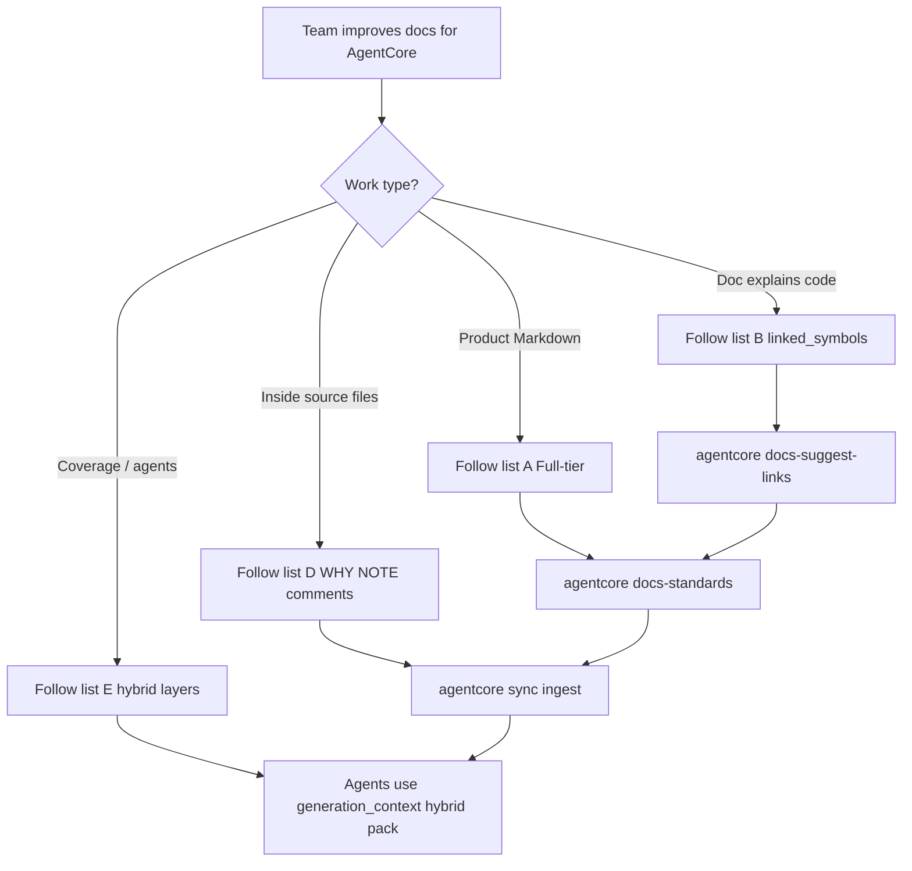

# TEAM HANDOUT - Complete AgentCore Documentation List

## Purpose

**Give this one file to the documentation / engineering team.** It is a complete copy of the reading lists, hard rules, and rationale for writing Markdown so AgentCore delivers the best results. Normative source documents stay where they are (do not move them); open each path below when implementing.

Playbook (same method, narrative form): [`team-documentation-playbook-for-agentcore.md`](./team-documentation-playbook-for-agentcore.md).

**Transferable modular review pack (give the whole folder to another team):**  
`.agentcore/handouts/agentcore-documentation-review-pack/` — start at `00-START-HERE.md` (copies only; sources not moved).

## Why (read this to the team)

AgentCore does not treat random Markdown as reliable context. It:

1. **Indexes** structured docs (Full-tier frontmatter, headings, lanes) for retrieval and guidance.
2. **Links** human docs to code via evidence-based `linked_symbols`, then builds `DOCUMENTED_BY` edges in the code knowledge graph after `agentcore sync`.
3. **Steers coding agents** (MCP guidance + authoring law) so “how do we write docs?” and “what does this code mean?” resolve to the same paths.

Unstructured docs, invented symbol links, or docs that never name the code they explain → weak graph, weak agent answers. This handout is the method to avoid that.

## Document flow (method)



| Step | Actor | Action | Outcome |
| --- | --- | --- | --- |
| 1 | Team | Read this handout | Know full list A + B + D + E |
| 2 | Author | Write/fix Markdown per list A | Machine-ingestible doc |
| 3 | Author | If doc explains code → list B (+ optional `docs-suggest-links`) | Graph-ready `linked_symbols` |
| 4 | Developer | In-source WHY/NOTE + English comments (list D) | Rationale nodes on ingest |
| 5 | Author / CI | `agentcore docs-standards` until zero issues | Conformance gate |
| 6 | Operator | `agentcore sync` | Code ingest + docs Phase 2 + `DOCUMENTED_BY` |
| 7 | Coding agent | List E hybrid pack via `generation_context` / MCP | Prefer human → living → rationale → AST |

---

## LIST A — Writing and fixing product docs (`docs/` and other normative trees)

Follow **in order**. Paths are from repository root.

| # | Name | Path (repo root) | What it owns |
| --- | --- | --- | --- |
| A0 | **TEAM HANDOUT (this file)** | `docs/agents/TEAM-HANDOUT-agentcore-documentation-complete.md` | Complete list for team delivery |
| A1 | **Team Documentation Playbook for AgentCore** | `docs/agents/team-documentation-playbook-for-agentcore.md` | Team entry narrative + why |
| A2 | **Documentation Authoring (All Agents)** | `docs/agents/documentation-authoring.md` | Portable law: when to write, review gate, hard requirements |
| A3 | **Professional documentation standard** | `docs/00-master-plan/06-professional-documentation-standard.md` | Tone, audience, content grade, designed-vs-shipped honesty |
| A4 | **Structure and machine-ingest standard** | `docs/00-master-plan/08-documentation-structure-and-machine-ingest-standard.md` | Placement, frontmatter, modularity, RAG shape |
| A5 | **Structure standard (continued)** | `docs/00-master-plan/08-documentation-structure-and-machine-ingest-standard-continued.md` | Continuation of A4 (soft-budget / modular splits) |
| A6 | **Classification and lanes** | `docs/00-master-plan/09-documentation-classification-and-lanes.md` | Closed-set lane enums |
| A7 | **Documentation standardization procedure** | `docs/00-master-plan/10-documentation-standardization-procedure.md` | Remediation how-to: issue codes, splits, acceptance, `linked_symbols` §6 |
| A8 | **Docs tree README / map** | `docs/README.md` | Phase map and reading order for `docs/` |
| A9 | **Agents index** | `docs/agents/00-index.md` | Index of agent/team docs in this folder |

### LIST A — optional helpers (agents doing the edits)

| # | Name | Path (repo root) | What it owns |
| --- | --- | --- | --- |
| A10 | Write-documentation skill | `.agents/skills/write-documentation/` | Skill for agents writing docs |
| A11 | Write-documentation guide | `docs/agents/write-documentation.md` | Guide paired with the skill |
| A12 | MCP-first skills and rules | `docs/15-agent-workspace-guidance/06-mcp-first-agent-skills-and-rules.md` | Seed skills including documentation authoring |

### LIST A — design-doc diagram rule (mandatory for design types)

| # | Rule | Where defined |
| --- | --- | --- |
| A13 | Design docs (`hld` / `lld` / `feature_spec` / `service_design`): Mermaid **plus** matching agent-readable flow table in the **same H2** | A2 authoring law + A7 procedure 10 |

### LIST A — MCP (when coding agent is connected to AgentCore)

| # | Item | How |
| --- | --- | --- |
| A14 | Tool `agentcore_docs_authoring_standards` | Call before writing/explaining product Markdown |
| A15 | Skill `agentcore-documentation-authoring` | Via `agentcore_guidance_get_skill` |

---

## LIST B — Linking docs to code (graph + AgentCore quality)

Use when Markdown **explains or owns code behavior**.

| # | Name | Path (repo root) | What it owns |
| --- | --- | --- | --- |
| B1 | **`linked_symbols` rules** (procedure 10 §6) | `docs/00-master-plan/10-documentation-standardization-procedure.md` | Evidence-only tokens; never invent symbols |
| B2 | **Docs-as-code sync index** | `docs/03-docs-as-code-sync/00-index.md` | Sync mission; Phase 2 bridge |
| B3 | **Docs-as-code feature specification** | `docs/03-docs-as-code-sync/01-feature-specification.md` | Sync/drift product requirements |
| B4 | **Docs-as-code high-level design** | `docs/03-docs-as-code-sync/02-high-level-design.md` | Actors, components, sync flow |
| B5 | **Docs-as-code low-level design** | `docs/03-docs-as-code-sync/03-low-level-design.md` | Anchors, frontmatter validation, drift, CI gates |
| B6 | **Ingestion and living documentation workflow** | `docs/07-code-knowledge-graph/03-ingestion-and-living-documentation-workflow.md` | Human docs → graph nodes + `DOCUMENTED_BY` |
| B7 | **CLI command reference** (`docs-standards`, `sync`, related) | `docs/08-software-engineering-architecture/42-agentcore-cli-command-reference.md` | Exact commands and flags |

### LIST B — token forms (must follow)

| Allowed `linked_symbols` form | Example idea |
| --- | --- |
| Qualified name that resolves after code ingest | `pkg.module.Class.method` |
| `path::Symbol` evidenced on disk | `backend/packages/foo/bar.py::MyClass` |
| Existing symbol id | Graph symbol id after sync |
| Empty list | Doc does **not** explain code (architecture-only OK) |

**Forbidden:** invented symbols, guesswork links, “link everything” without path/evidence.

---

## LIST D — Documentation **inside source code** (comments / rationale AgentCore reads)

Markdown under `docs/` is not enough for best AgentCore results. On ingest, AgentCore also reads **in-source** signals: AST symbols, and tagged rationale comments that become `RATIONALE` nodes with `DOCUMENTED_BY` from the file.

### D1 — What to write in code (do this)

| # | Practice | How | Why AgentCore cares |
| --- | --- | --- | --- |
| D1 | **English only** in committed comments and docstrings | Same as Markdown law | Agents and indexes expect English |
| D2 | **Explain non-obvious WHY**, not restating the next line | Prefer intent, constraint, failure mode, tradeoff | Graph + agents use rationale bodies as context |
| D3 | **Tagged rationale comments** (ingested as `RATIONALE`) | `# WHY: …` · `# NOTE: …` · `# HACK: …` (language-appropriate comment syntax) | Extracted on file ingest → symbol + `DOCUMENTED_BY` from the file |
| D4 | **Useful docstrings / API docs** on public surfaces | Short contract: inputs, outputs, errors — not marketing | Helps humans and living-doc / explore packs; do not duplicate a novel in every function |
| D4a | **Module contract docstring** on hard modules only | File-top 3–6 lines: role + source of truth / invariants + allowed vs forbidden failures | Stops agents inventing wrong SoT or crash policy; normative: `docs/08-software-engineering-architecture/49-module-contract-docstrings-standard.md` |
| D4b | **Package/folder README map** (selective) | Purpose + boundaries + 2–5 start-here files; **not** a paragraph per file | Orients agents to ownership; normative: `docs/08-software-engineering-architecture/50-package-folder-readme-standard.md` |
| D5 | **Stopgaps only when user approved** | `# tsoc-defer: <reason>; remove when <trigger>; real fix: <one line>` | Tracked debt; never fake “done” |
| D6 | **Never** commit `ponytail:` markers | Plain English or `tsoc-defer` only | Repo law overrides upstream ponytail skill text |

Example (Python):

```python
# WHY: keep tokens short for agent context packs
def pack_context(items: list[str]) -> str:
    ...
```

### D2 — What not to put only in code

| Anti-pattern | Do instead |
| --- | --- |
| Long architecture essays in comments | Full-tier Markdown under `docs/` + evidence `linked_symbols` (LIST A + B) |
| Per-file encyclopedia in every folder `README.md` | Short ownership map only (`50-…`); hard contracts in module docstrings (`49-…`) |
| Invented `# WHY:` that does not match the code | Fix code or delete the comment |
| Persian (or non-English) in committed source comments | English only |
| `ponytail:` or “agent will wire later” stubs | Ship the work, open an issue/ADR, or `tsoc-defer` with user approval |

### D3 — Normative / skill pointers for in-code docs

| # | Name | Path (repo root) | Role |
| --- | --- | --- | --- |
| D7 | Source-comments skill | `.agents/skills/tsoc-source-comments/SKILL.md` | Law for comments: English / `tsoc-defer` / no `ponytail:` |
| D7a | Module contract docstrings | `docs/08-software-engineering-architecture/49-module-contract-docstrings-standard.md` | When/how to write selective module-level SoT + failure-policy headers |
| D7b | Package/folder README maps | `docs/08-software-engineering-architecture/50-package-folder-readme-standard.md` | Short ownership maps; rejects per-file encyclopedias in folder READMEs |
| D8 | Ponytail project rule | `.cursor/rules/ponytail.mdc` | YAGNI + comment policy (no `ponytail:` in source) |
| D9 | Code intelligence enhancements (rationale wave) | `docs/07-code-knowledge-graph/22-code-intelligence-enhancements-feature-specification.md` | `WHY` / `NOTE` / `HACK` → `RATIONALE` + `DOCUMENTED_BY` |
| D10 | Ingestion and living documentation workflow | `docs/07-code-knowledge-graph/03-ingestion-and-living-documentation-workflow.md` | Sync ingest: symbols + living docs; human Markdown is separate |
| D11 | Acceptance (rationale shipped) | `docs/07-code-knowledge-graph/26-code-intelligence-enhancements-risks-challenges-and-acceptance.md` | Confirms rationale-from-comments acceptance |

### D4 — How this relates to LIST A / B

| Layer | What you write | AgentCore effect |
| --- | --- | --- |
| **In code** (LIST D) | `# WHY:` / docstrings / `tsoc-defer` | Rationale nodes + symbol context on ingest |
| **Human Markdown** (LIST A) | Full-tier docs under `docs/` | Indexed documentation nodes |
| **Links** (LIST B) | Evidence `linked_symbols` | `DOCUMENTED_BY` from code symbols → human docs |

Best results = **all three**, not Markdown alone.

---

## LIST E — Hybrid coverage (how agents fill gaps when a layer is missing)

AgentCore does **not** require every layer for a symbol. The hybrid pack merges layers so one missing layer is covered by lower-priority layers.

| Layer | Required? | How you create it | Agent preference |
| --- | --- | --- | --- |
| AST | After Phase 1 ingest | `agentcore sync` on code | Always available for ingested seeds |
| Living | Optional | Ingest heuristic / LLM `ai_documentation` | After human |
| Human | Optional | Full-tier Markdown + evidence `linked_symbols` + sync Phase 2 | Highest |
| Rationale | Optional | `# WHY:` / `# NOTE:` / `# HACK:` in source + re-ingest | After living |

**Preference:** human → living → rationale → AST.

| # | Name | Path / command | Role |
| --- | --- | --- | --- |
| E1 | Hybrid documentation coverage (normative) | `docs/07-code-knowledge-graph/41-hybrid-documentation-coverage.md` | Full layer model + optional behaviors |
| E2 | Ingestion / living workflow | `docs/07-code-knowledge-graph/03-ingestion-and-living-documentation-workflow.md` | Phase 1 / Phase 2 + hybrid note |
| E3 | Suggest evidence links | `agentcore docs-suggest-links` | Optional dry-run / `--apply`; sync Phase 2 also merges evidence by default |
| E4 | Docs catalog (tags/lanes) | `agentcore docs-catalog` · MCP `agentcore_docs_catalog` · [`42-…`](../07-code-knowledge-graph/42-documentation-catalog-and-lane-cache.md) | Narrow Markdown to Read; sync uses catalog to **order** Phase 2 (no tag→edge) |
| E5 | Generation context (MCP / CLI) | `agentcore_code_graph_generation_context` · `agentcore graph generation-context` | Read path: `hybrid_documentation` pack |

**Optional (explicit):**

| Optional | Do this | Do not |
| --- | --- | --- |
| No human docs yet | Rely on living / rationale / AST | Invent `DOCUMENTED_BY` |
| No living LLM docs | Rationale + AST still cover | Treat living as mandatory |
| No `# WHY:` comments | AST (+ other layers) still cover | Invent rationale nodes offline |
| Suggest without frontmatter | Fix Full-tier FM first; `--apply` skips (`skipped_no_frontmatter`) | Auto-create frontmatter via suggest |
| Sync evidence merge | Leave defaults on; cite real paths in body | Invent tags→edges; disable only via env if needed |
| Alternate doc trees | `--docs-root backend/docs` | Assume only `docs/` exists |
| LLM free-form pairing | Deferred; may suggest later for humans | Auto-write edges without resolve |

---

## LIST C — Where files live (trees)

| # | Tree | Path | What belongs there |
| --- | --- | --- | --- |
| C1 | Product docs | `docs/` | AgentCore product design and standards (phases 00–15) |
| C2 | Agents / team ops | `docs/agents/` | Authoring law, this handout, IDE agent docs |
| C3 | Backend standards | `backend/docs/` | Service/topic standards when that tree owns the topic |
| C4 | Frontend docs | `frontend/docs/` | Frontend Markdown (same Full-tier law) |
| C5 | Deploy toolkit | `deploy-toolkit/` | Deploy Markdown (same Full-tier law) |
| C6 | AI toolstack docs | `ai-toolstack/docs/` | IDE tooling docs (same Full-tier law) |

---

## Hard rules (do not skip)

1. **English only** in committed Markdown.
2. **Full-tier frontmatter** for normative docs under `docs/` (`doc_id` = `ac.doc.<domain>.<slug>`, all lanes, Purpose H2, one H1 = title).
3. **Size budgets** — soft ~400 body lines, hard ~800; split instead of mega-files.
4. **`linked_symbols`** — empty if no code explanation; otherwise evidence-only (see LIST B). Prefer `agentcore docs-suggest-links` then human review — never invent symbols.
5. **Design docs** — Mermaid + matching flow table in the same H2 (see A13).
6. **Gate** — `agentcore docs-standards` → zero issues before calling a file done. Prefer `agentcore quality-audit` for broader docs+code health.
7. **Sync** — after material doc/code changes: `agentcore sync` so Phase 2 indexes docs, merges evidence path citations by default, and creates `DOCUMENTED_BY` for resolved links.
8. **Hybrid** — missing optional layers are OK; agents fall back (LIST E). Never invent graph edges on suggest or read.

---

## Verification commands

| Goal | Command |
| --- | --- |
| Doc conformance | `agentcore docs-standards` |
| Evidence link suggestions | `agentcore docs-suggest-links` (dry-run) · `--apply` after review |
| Broader docs + code health | `agentcore quality-audit` |
| Index docs + project `DOCUMENTED_BY` | `agentcore sync` (Phase 2 docs) |

---

## What “best AgentCore results” looks like

| Without this method | With this method |
| --- | --- |
| Agents skim prose and guess | Agents load laws + skills + graph neighbors |
| Docs invisible to the graph | `DOCUMENTATION` nodes + `DOCUMENTED_BY` to real symbols |
| Drift unknown until review | docs-sync / quality-audit surface gaps |
| Duplicate conflicting guides | One portable law + procedure 10 acceptance |

---

## One-paragraph brief (paste to teammate)

> Use the complete handout `docs/agents/TEAM-HANDOUT-agentcore-documentation-complete.md`. Follow LIST A (`documentation-authoring` + master-plan `06` / `08` / `08-continued` / `09` / `10`). If a doc explains code, follow LIST B (`linked_symbols` evidence-only + docs-as-code `03` + living-docs workflow `07`; optional `agentcore docs-suggest-links`). **Inside source code**, follow LIST D (`# WHY:` / `# NOTE:` / `# HACK:`, English comments, `tsoc-defer` only — skill `tsoc-source-comments`). **Hybrid coverage** is LIST E (`41-hybrid-documentation-coverage.md`: human → living → rationale → AST). Verify with `agentcore docs-standards`, then `agentcore sync`, so AgentCore can link docs to the code graph and guide coding agents correctly.

---

## Related Documents

- [`team-documentation-playbook-for-agentcore.md`](./team-documentation-playbook-for-agentcore.md) — same method in playbook form.
- [`documentation-authoring.md`](./documentation-authoring.md) — portable authoring law.
- [`../00-master-plan/10-documentation-standardization-procedure.md`](../00-master-plan/10-documentation-standardization-procedure.md) — remediation + `linked_symbols`.
- [`../03-docs-as-code-sync/00-index.md`](../03-docs-as-code-sync/00-index.md) — docs ↔ code sync.
- [`../07-code-knowledge-graph/03-ingestion-and-living-documentation-workflow.md`](../07-code-knowledge-graph/03-ingestion-and-living-documentation-workflow.md) — human docs in the graph.
- [`../07-code-knowledge-graph/41-hybrid-documentation-coverage.md`](../07-code-knowledge-graph/41-hybrid-documentation-coverage.md) — hybrid layers + optional behaviors.
