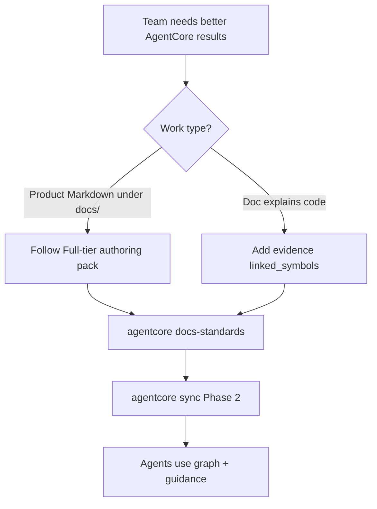

# Team Documentation Playbook for AgentCore

## Purpose

Tell engineering and documentation teams **exactly which documents to follow** when writing or fixing Markdown so AgentCore can index docs, link them to code, and give connected coding agents reliable context. This playbook is the **team entry**; deeper rules live in the linked standards—do not invent a parallel style.

**Single complete handout for team delivery (full LIST A/B/C/D/E):** [`TEAM-HANDOUT-agentcore-documentation-complete.md`](./TEAM-HANDOUT-agentcore-documentation-complete.md) (also copied under `.agentcore/handouts/` — originals are not moved). LIST D covers **in-source** documentation (`# WHY:` / `# NOTE:` / `# HACK:`, English comments, `tsoc-defer`). LIST E covers **hybrid** layers (human → living → rationale → AST) and `agentcore docs-suggest-links`.

## Why this method exists

AgentCore is not a chat summarizer of random Markdown. It:

1. **Indexes** structured docs (frontmatter, headings, lanes) for retrieval and guidance.
2. **Links** human docs to code symbols via evidence-based `linked_symbols`, then projects `DOCUMENTED_BY` edges in the code knowledge graph after `agentcore sync`.
3. **Steers agents** through MCP guidance and authoring law so “how do I write docs?” and “what does this module mean?” resolve to the same normative paths.

If docs are unstructured, lack Full-tier metadata, invent symbol links, or never name the code they explain, AgentCore cannot build useful edges. Agents then fall back to blind search and weaker answers. Following this playbook maximizes **retrieve → link → guide** quality.

## Document flow

| Step | Actor | Action | Outcome |
| --- | --- | --- | --- |
| 1 | Team | Open this playbook + portable authoring law | Know which standards apply |
| 2 | Author | Write/fix Markdown per Full-tier rules | Machine-ingestible doc |
| 3 | Author | Add evidence `linked_symbols` when the doc explains code | Graph-ready tokens |
| 4 | Author / CI | Run `agentcore docs-standards` until zero issues | Conformance gate |
| 5 | Operator | Run `agentcore sync` (docs Phase 2) | Index + `DOCUMENTED_BY` for resolved tokens |
| 6 | Coding agent | `guidance_resolve` / code-graph explore / authoring standards tool | Uses linked docs and laws |

## Canonical reading list (give this to authors)

### A. Writing and fixing product docs under `docs/` (and other normative trees)

Hand these first—in this order:

| # | Document | Path | Role |
| --- | --- | --- | --- |
| 1 | **Team Documentation Playbook for AgentCore** (this file) | [`docs/agents/team-documentation-playbook-for-agentcore.md`](./team-documentation-playbook-for-agentcore.md) | Team entry: why + which docs |
| 2 | **Documentation Authoring (All Agents)** | [`docs/agents/documentation-authoring.md`](./documentation-authoring.md) | Portable law: when to write, review gate, hard requirements |
| 3 | **Professional documentation standard** | [`docs/00-master-plan/06-professional-documentation-standard.md`](../00-master-plan/06-professional-documentation-standard.md) | Tone, audience, content grade, designed-vs-shipped honesty |
| 4 | **Structure and machine-ingest standard** | [`docs/00-master-plan/08-documentation-structure-and-machine-ingest-standard.md`](../00-master-plan/08-documentation-structure-and-machine-ingest-standard.md) (+ [`…-continued.md`](../00-master-plan/08-documentation-structure-and-machine-ingest-standard-continued.md)) | Placement, frontmatter, modularity, RAG shape |
| 5 | **Classification and lanes** | [`docs/00-master-plan/09-documentation-classification-and-lanes.md`](../00-master-plan/09-documentation-classification-and-lanes.md) | Closed-set lane enums |
| 6 | **Documentation standardization procedure** | [`docs/00-master-plan/10-documentation-standardization-procedure.md`](../00-master-plan/10-documentation-standardization-procedure.md) | How to remediate: issue codes, splits, acceptance |
| 7 | **Diagrams and agent-readable flows** | Use design-doc rules in procedure `10` and authoring law; Mermaid **plus** matching flow table for `hld` / `lld` / `feature_spec` / `service_design` | Agents parse flows without screenshots |

Optional skill/guide for agents doing the edits:

| Document | Path |
| --- | --- |
| Write-documentation skill | [`.agents/skills/write-documentation/`](../../.agents/skills/write-documentation/) |
| Write-documentation guide | [`docs/agents/write-documentation.md`](./write-documentation.md) |

MCP coding agents (when connected): call `agentcore_docs_authoring_standards` and skill `agentcore-documentation-authoring` (same Full-tier checklist).

### B. Linking docs to code (so the graph and AgentCore help)

Hand these when the Markdown **explains or owns code behavior**:

| # | Document | Path | Role |
| --- | --- | --- | --- |
| 1 | **`linked_symbols` rules** (in procedure 10 §6) | [`docs/00-master-plan/10-documentation-standardization-procedure.md`](../00-master-plan/10-documentation-standardization-procedure.md) | Evidence-only tokens; never invent symbols |
| 2 | **Docs-as-code sync index** | [`docs/03-docs-as-code-sync/00-index.md`](../03-docs-as-code-sync/00-index.md) | Sync mission, Phase 2 bridge |
| 3 | **Docs-as-code feature specification** | [`docs/03-docs-as-code-sync/01-feature-specification.md`](../03-docs-as-code-sync/01-feature-specification.md) | Product requirements for sync/drift |
| 4 | **Ingestion and living documentation workflow** | [`docs/07-code-knowledge-graph/03-ingestion-and-living-documentation-workflow.md`](../07-code-knowledge-graph/03-ingestion-and-living-documentation-workflow.md) | How human docs become graph nodes + `DOCUMENTED_BY` |
| 5 | **CLI command reference (sync / docs-standards)** | [`docs/08-software-engineering-architecture/42-agentcore-cli-command-reference.md`](../08-software-engineering-architecture/42-agentcore-cli-command-reference.md) | Exact commands and flags |

### C. Tree map (where files live)

| Tree | What belongs there |
| --- | --- |
| [`docs/`](../README.md) | AgentCore product design and standards (phases 00–15) |
| [`docs/agents/`](./00-index.md) | How agents/teams author and operate in this repo |
| `backend/docs/` | Backend service/topic standards when that tree owns the topic |
| `frontend/docs/`, `deploy-toolkit/`, `ai-toolstack/docs/` | Same Full-tier authoring law when editing those Markdown trees |

## Hard rules teams must not skip

1. **English only** in committed Markdown.
2. **Full-tier frontmatter** for normative docs under `docs/` (`doc_id` = `ac.doc.<domain>.<slug>`, lanes, Purpose H2, one H1 = title).
3. **Size budgets** — soft ~400 body lines, hard ~800; split instead of mega-files.
4. **`linked_symbols`** — empty if the doc does not explain code; otherwise only tokens that resolve or are path-evidenced (`qualified_name`, `path::Symbol`, or symbol id). Fake links poison the graph.
5. **Design docs** — Mermaid and a matching agent-readable flow table in the same H2.
6. **Gate** — `agentcore docs-standards` reports zero issues for files you claim “done.” Prefer `agentcore quality-audit` for a broader docs+code health check.
7. **Sync** — after material doc/code changes, run `agentcore sync` so Phase 2 can index docs and create `DOCUMENTED_BY` for resolved links.

## What “best AgentCore results” looks like

| Without this method | With this method |
| --- | --- |
| Agents skim prose and guess | Agents load laws + skills + graph neighbors |
| Docs invisible to the graph | `DOCUMENTATION` nodes + `DOCUMENTED_BY` to real symbols |
| Drift unknown until review | docs-sync / quality-audit surface gaps |
| Duplicate conflicting guides | One portable law + procedure 10 acceptance |

## One-paragraph brief for a teammate

> Fix our Markdown using the Team Documentation Playbook (`docs/agents/team-documentation-playbook-for-agentcore.md`). Follow Documentation Authoring plus master-plan `06` / `08` / `09` / `10`. For any doc that explains code, add evidence-only `linked_symbols` per procedure 10 and docs-as-code (`03`) / living-docs workflow (`07` § human docs). Verify with `agentcore docs-standards`, then `agentcore sync`, so AgentCore can link docs to the code graph and guide coding agents correctly.

## Related Documents

- [`documentation-authoring.md`](./documentation-authoring.md) — portable authoring law.
- [`../00-master-plan/10-documentation-standardization-procedure.md`](../00-master-plan/10-documentation-standardization-procedure.md) — remediation and `linked_symbols` rules.
- [`../03-docs-as-code-sync/00-index.md`](../03-docs-as-code-sync/00-index.md) — docs ↔ code sync phase.
- [`../07-code-knowledge-graph/03-ingestion-and-living-documentation-workflow.md`](../07-code-knowledge-graph/03-ingestion-and-living-documentation-workflow.md) — graph projection of human docs.
- [`../15-agent-workspace-guidance/06-mcp-first-agent-skills-and-rules.md`](../15-agent-workspace-guidance/06-mcp-first-agent-skills-and-rules.md) — MCP-first skills including documentation authoring.
